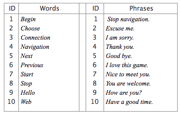

# LipNet
  This project was basically started by  Yannis M. Assael, Brendan Shillingford, Shimon Whiteson, Nando de Freitas	Oxford University in collaboration with google deep-minds in 2016.
Lip-reading is the task of decoding text from the movement of a speaker’s mouth. Traditional approaches separated the problem into two stages: designing or learning visual features, and prediction. More recent deep lip-reading approaches are end-to-end trainable (Wand et al., 2016; Chung & Zisserman, 2016a). However, existing work on models trained end-to-end perform only word classification, rather than sentence-level sequence prediction. Studies have shown that human lip-reading performance increases for longer words (Easton & Basala, 1982), indicating the importance of features capturing temporal context in an ambiguous communication channel. Motivated by this observation, we present our model LipSync, that maps a variable-length sequence of video frames to text, making use Deep neural networks, classification loss, trained entirely end-to-end. To the best of our knowledge, LipNet by Oxford University was the first end-to-end sentence-level lip-reading model that simultaneously learns spatiotemporal visual features and a sequence model. On the GRID audio-visual sentence corpus, LipNet achieves 95.2% accuracy in sentence-level, overlapped speaker split task, outperforming experienced human lip-readers and the previous 86.4% word-level state-of-the-art accuracy (Gergen et al., 2016).

## Dataset:
  MIRACL-VC1 Dataset - https://sites.google.com/site/achrafbenhamadou/-datasets/miracl-vc1
  It has the following labels:
  

## Problem Statement:
    Input : A Video file of a person speaking some word or phrase.
    Output : The predicted word or phrase the person was speaking.

## Technologies and frameworks :
    - Tensorflow1.2.1
    - Keras
    - Opencv3
    - python 3.5

## Use case:
- Help in understanding what the speaker is speaking when there is noise in the background (like when travelling in a vehicle or watching a video in a very noise gatherings).
- Help for the deaf people to understand what the other person is speaking. If we can integrate this project to an IOT device, then this can be a device that can be sent to the production line to be a very big help for the people with disabled hearing.
- A tool that can be used by the intelligence agencies for spying purpose.

## Reference :
- Yannis M. Assael, Brendan Shillingford, Shimon Whiteson, Nando de Freitas, “ LipNet: End-To-End Sentence-Level Lip-reading”on 2016. [Read link](https://arxiv.org/abs/1611.01599)
- Amit Garg, Jonathan Noyola, Sameep Bagadia, 2017 “Lip reading using CNN and and LSTM ” on 2017  [Read link](http://cs231n.stanford.edu/reports/2017/pdfs/227.pdf)
- Andrew Owens, Phillip Isola, Josh McDermott, Antonio Torralba, Edward H. Adelson, William T. Freeman,  “Visually Indicated Sounds” on 2016 [Read link](https://arxiv.org/abs/1512.08512)
- Joon Son Chung, Andrew Senior, Oriol Vinyals, Andrew  Zisserman, “Lip Reading in Wild” on 2016 [Read link](https://arxiv.org/abs/1611.05358)
- Joon Son Chung and Andrew Zisserman , “ Out of time: automated lip sync in the wild”, on 2016 [Read link](https://www.robots.ox.ac.uk/~vgg/publications/2016/Chung16a/chung16a)
